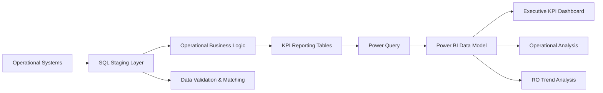
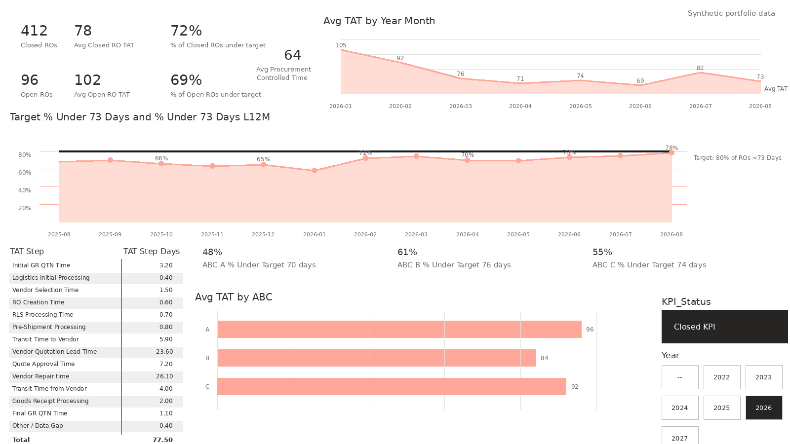
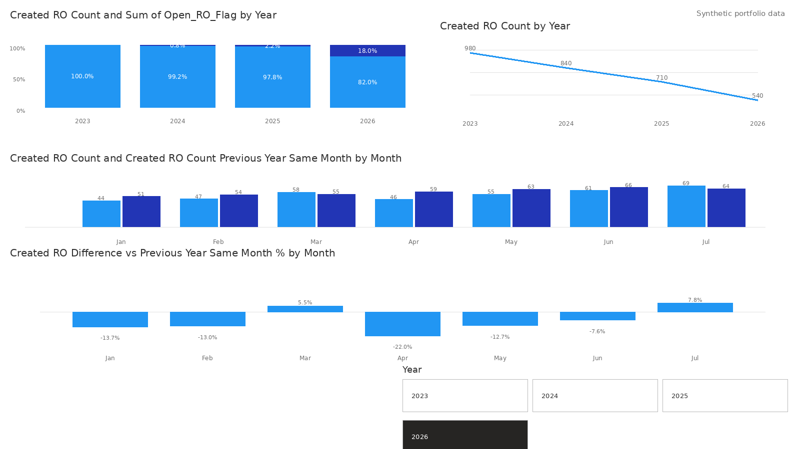

# Aviation Procurement KPI Dashboard

End-to-end aviation procurement analytics solution built with **Power BI, SQL, Power Query and DAX** to transform operational procurement data into management KPIs, operational process analysis and actionable performance insights.

> **Portfolio version:** This repository contains a sanitized representation of a real-world analytics solution. Company-confidential data, credentials, customer/vendor identities and proprietary production information are excluded.

---

## Project Overview

Procurement performance data is often distributed across multiple operational processes including sourcing, repair orders, logistics, receipts and inventory movements.

The objective of this project was to create a consolidated analytics solution capable of:

- Measuring procurement turnaround time
- Monitoring operational KPIs
- Tracking open and completed repair orders
- Breaking total turnaround time into operational process stages
- Identifying long-running and exceptional cases
- Analysing repair-order creation trends
- Supporting management-level reporting
- Supporting drill-down from KPIs to operational transactions
- Reducing manual reporting effort

---

## Technology Stack

| Technology | Purpose |
|---|---|
| Power BI | Dashboarding and interactive analytics |
| DAX | KPI measures and analytical calculations |
| SQL | Reporting layer, transformation logic and KPI preparation |
| Power Query | Data preparation and integration |
| Excel | Supporting operational analysis |
| Python | Automated refresh workflows |
| Power Automate | Scheduled SQL refresh and reporting processes |
| Salesforce / AvSight | Operational source data |

---

## Solution Architecture



The architecture separates operational source data from the reporting layer so that relationship logic, operational milestones and KPI calculations can be applied consistently before data reaches Power BI.

---

## Key Analytics Areas

### Procurement Turnaround Time

The solution measures the time required for repair and procurement activity to progress through defined operational milestones.

Rather than treating turnaround time as a single number, the reporting model breaks the process into individual stages.

Example stages include:

- Vendor Selection
- RO Creation
- Release Processing
- Pre-Shipment Processing
- Transit to Vendor
- Vendor Quotation
- Quote Approval
- Vendor Repair
- Transit from Vendor
- Goods Receipt Processing
- Quarantine / Final Processing

This makes it possible to identify **where time is being spent**, rather than only measuring the final result.

---

### KPI Performance

The KPI layer provides visibility into:

- Closed repair orders
- Open repair orders
- Average closed RO turnaround time
- Open-case ageing
- Performance against turnaround-time target
- Outlier repair orders
- Performance trends by year and month
- Operational process-step timing

A repair order is treated as closed when either the repair-order header or associated repair-order line reaches the applicable completed status.

---

### Target & Outlier Logic

The portfolio SQL demonstrates the KPI classification logic used by the reporting model.

```text
KPI TAT < 73 days
        ↓
Within target

KPI TAT > 150 days
        ↓
TAT outlier
```

The thresholds are applied at the reporting layer so Power BI receives KPI-ready records.

---

## Operational Relationship Logic

Operational data does not always contain a single perfect relationship between records.

One example is the matching of docking events to repair-order activity.

The SQL model evaluates multiple relationship paths:

```text
Repair Order Line match
        ↓
Priority 1

Repair Order match
        ↓
Priority 2

Return AWB match
        ↓
Priority 3
```

The strongest available evidence is selected.

If multiple records exist at the same priority, the earliest valid event is selected, with a deterministic identifier used as the final tie-breaker.

This allows incomplete operational relationships to be resolved systematically while keeping the matching logic auditable.

---

## Reporting Flow

```text
Operational Data
      ↓
SQL Helper / Stage Tables
      ↓
Relationship Matching
      ↓
Operational Milestones
      ↓
Process-Step Calculations
      ↓
Repair Order KPI Layer
      ↓
Power Query
      ↓
Power BI Data Model
      ↓
Executive & Operational Dashboards
```

---

## KPI Logic

A simplified representation of the calculation process is:

```text
Identify procurement / repair process
              ↓
Determine applicable start milestone
              ↓
Determine operational completion milestone
              ↓
Calculate process-step durations
              ↓
Calculate total KPI turnaround time
              ↓
Determine open / closed status
              ↓
Compare against KPI target
              ↓
Identify outliers
              ↓
Aggregate for Power BI
```

Different operational processes can require different milestone logic before KPI results are produced.

---

## Dashboard Preview

The screenshots below use **synthetic portfolio data** and are based on the structure of the original Power BI solution.

### Executive Procurement Dashboard



The executive dashboard combines:

- Closed and open repair-order KPIs
- Procurement turnaround time
- KPI target achievement
- Monthly performance trends
- Process-step timing
- Open workload
- Outlier analysis
- Operational performance segmentation

---

### RO Creation Trend Analysis



The RO trend view analyses repair-order creation volumes across years and months and supports comparisons with previous periods.

A key modelling decision is that **repair-order creation counts are sourced directly from repair-order headers**, rather than from the KPI fact table.

This prevents differences in analytical grain from distorting historical creation volumes.

---

## SQL Portfolio Examples

The repository contains three sanitized SQL examples derived from the reporting architecture.

### 1. Reporting Model

📄 [View reporting-model.sql](reporting-model.sql)

Demonstrates:

- Helper and staging tables
- Operational entity joins
- Receipt aggregation
- Inventory milestone reconstruction
- Release aggregation
- Priority-based docking matching
- Deterministic best-record selection
- Process-step calculations
- KPI-ready operational data preparation

---

### 2. KPI Calculations

📄 [View kpi-calculations.sql](kpi-calculations.sql)

Demonstrates:

- One-row-per-repair-order KPI modelling
- Open / closed classification
- Open-case ageing
- KPI turnaround-time calculation
- Target achievement logic
- Outlier classification
- Operational process-step aggregation
- Annual KPI summaries

---

### 3. RO Creation Trend

📄 [View ro-created-trend.sql](ro-created-trend.sql)

Demonstrates:

- Repair-order header modelling
- Repair-order-line status aggregation
- Cancelled-order handling
- Created / open / closed classification
- Monthly aggregation
- Yearly aggregation
- Power BI trend-table preparation

---

## SQL Architecture

The reporting model follows a layered approach:

```text
Source Tables
     │
     ├── Repair Orders
     ├── Repair Order Lines
     ├── Inventory
     ├── Receipts
     ├── Releases
     ├── Docking Events
     └── Operational History
              ↓
        Helper Tables
              ↓
      Relationship Logic
              ↓
     Operational Measures
              ↓
        KPI Flat Table
              ↓
      KPI Aggregations
              ↓
           Power BI
```

This approach moves complex operational logic out of Power BI and into a reusable reporting layer.

---

## DAX Portfolio Example

📄 [View dax-measures.md](dax-measures.md)

The repository includes a sanitized DAX measure layer based on the analytical structure of the Power BI model.

It demonstrates:

- Closed and open repair-order measures
- Average turnaround-time calculations
- KPI target achievement percentages
- TAT outlier measures
- Open-case ageing measures
- Monthly KPI calculations
- Repair-order creation trend measures
- Previous-year same-month comparisons
- Year-to-date and previous-year time intelligence
- Process-step reporting using a disconnected `TAT Steps` table and `SWITCH`

The implementation keeps operational relationship and row-level KPI logic in SQL while using DAX for filter-context aggregation, percentages, time intelligence and interactive report behaviour.

---

## Data Modelling Decisions

Several modelling decisions were important to the solution.

### One Reporting Grain

Operational source systems can contain multiple lines and events for a single repair order.

The KPI layer consolidates these into a consistent repair-order reporting grain before the data is consumed by Power BI.

### Closed Status

A repair order can be considered complete based on either the repair-order header or the underlying repair-order-line status.

The model therefore evaluates both levels.

### Priority-Based Relationships

Where several possible relationships exist, matching evidence is explicitly ranked instead of relying on an arbitrary join.

### Source-of-Truth Separation

Different analytical questions can require different source grains.

For example:

- KPI performance uses the KPI reporting model.
- Repair-order creation counts use repair-order headers as the source of truth.

This avoids using one analytical fact table for every business question.

---

## Automation

The production reporting environment also includes automated processes supporting:

- SQL reporting-table refresh
- Power BI dataset refresh
- Excel reporting refresh
- Data-quality checks
- Exception reporting
- Scheduled operational reporting
- Refresh-status logging

This reduces manual reporting effort and improves consistency between reporting cycles.

---

## Repository Structure

```text
aviation-procurement-kpi-dashboard/
│
├── README.md
│
├── executive-dashboard-portfolio-safe.png
├── ro-created-trend-portfolio-safe.png
│
├── reporting-model.sql
├── kpi-calculations.sql
├── ro-created-trend.sql
└── dax-measures.md
```

Additional portfolio examples may be added later.

---

## Power Query

Power Query is used as an additional transformation layer between SQL reporting datasets and the Power BI model.

Typical responsibilities include:

- Data type standardization
- Column cleanup
- Dataset integration
- Reporting-specific filtering
- Additional classification logic
- Supporting analytical attributes

A sanitized Power Query example may be added to the repository later.

---

## DAX

DAX provides the interactive analytical measure layer inside Power BI.

The current sanitized portfolio example includes:

- KPI percentages
- Closed repair-order measures
- Open repair-order measures
- Average TAT
- Target achievement
- Outlier counts and percentages
- Period comparisons
- RO creation trends
- YTD and previous-year comparisons
- Process-step measures

📄 [View the DAX portfolio file](dax-measures.md)

---

## Skills Demonstrated

This project demonstrates practical experience with:

- Power BI development
- SQL
- DAX
- Power Query
- Data modelling
- KPI design
- Operational process modelling
- Relationship resolution
- Data-quality validation
- Reporting architecture
- Process automation
- Procurement analytics
- Aviation supply-chain analytics

---

## Business Value

The solution converts fragmented operational data into a structured procurement-performance framework.

Key benefits include:

- Improved visibility of procurement performance
- Clear measurement of turnaround time
- Identification of operational bottlenecks
- Visibility into individual process stages
- Faster identification of long-running cases
- Consistent KPI calculations
- Improved operational reporting
- Reduced manual reporting work
- Drill-down from executive KPIs to individual transactions
- Reliable historical trend reporting

---

## Planned Portfolio Additions

Future sanitized examples may include:

- Power Query transformations
- Synthetic procurement datasets
- Additional architecture documentation
- Automation examples
- Data-quality validation examples

---

## Data Privacy

All publicly available examples in this repository use either:

- Synthetic data
- Anonymized identifiers
- Generic customer and vendor references
- Generalized schema and object names
- Simplified or sanitized business logic
- Sanitized dashboard screenshots

No confidential company data, production credentials, proprietary datasets, customer/vendor identities or personally identifiable information are published.

---

## Author

**Ivan**

Procurement Analytics · Power BI · SQL · Power Query · DAX · Automation · Aviation Data
