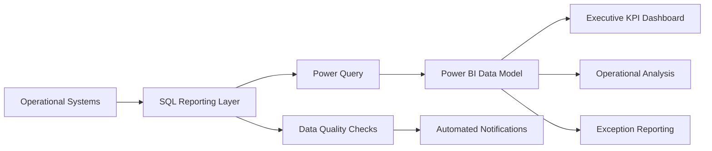

# Aviation Procurement KPI Dashboard

End-to-end aviation procurement analytics solution built with **Power BI, SQL, Power Query and DAX** to transform operational procurement data into management KPIs, exception reporting and actionable performance insights.

> **Portfolio version:** This repository contains a sanitized representation of a real-world analytics solution. Company-confidential data, credentials, customer/vendor identities and proprietary production information are excluded.

---

## Project Overview

Procurement performance data is often distributed across multiple operational processes including sourcing, repair orders, receipts, exchanges, logistics and invoicing.

The objective of this project was to create a consolidated analytics solution capable of:

- Measuring procurement turnaround time
- Monitoring operational KPIs
- Identifying long-running and exceptional cases
- Tracking open and completed procurement activity
- Detecting missing or inconsistent operational data
- Providing management-level reporting
- Supporting drill-down from KPIs to individual transactions
- Reducing manual reporting effort

---

## Technology Stack

| Technology | Purpose |
|---|---|
| Power BI | Dashboarding and interactive analytics |
| DAX | KPI measures and analytical calculations |
| SQL | Reporting layer, transformations and validation |
| Power Query | Data preparation and integration |
| Excel | Operational reporting and supporting analysis |
| Python | Automated refresh workflows |
| Power Automate | Scheduled reporting and notifications |
| Salesforce / AvSight | Operational source data |

---

## Solution Architecture



The architecture separates operational source data from the reporting layer so that business rules, transformations and validation logic can be applied consistently before the data reaches Power BI.

---

## Key Analytics Areas

### Procurement Turnaround Time

Measures the time required to progress procurement and repair activity through defined operational milestones.

The model supports:

- Completed-case TAT
- Open-case ageing
- Average and median TAT
- Target-performance measurement
- Long-running case identification
- Process-specific starting points

---

### KPI Performance

Management KPIs provide visibility into:

- Procurement performance against target
- Number of completed cases
- Number of open cases
- Cases outside expected turnaround time
- Performance trends over time
- Operational workload

---

### Exception Analysis

Operational exceptions can be isolated for investigation, including:

- Long-running procurement cases
- Missing milestone dates
- Missing operational information
- Incorrect date sequences
- Incomplete records
- Cases requiring manual review

This allows the dashboard to function not only as a reporting tool, but also as an operational management tool.

---

## Data Quality Framework

A significant part of the solution focuses on validating operational data before calculating KPIs.

Example validation categories include:

```text
Missing required milestone
Invalid date sequence
Incomplete procurement record
Missing relationship between operational records
Long-running open transaction
Reporting record requiring manual review
```

Separating data-quality checks from KPI calculations helps prevent incomplete or incorrect operational records from producing misleading performance results.

---

## Reporting Flow

```text
Operational Data
      ↓
SQL Reporting Layer
      ↓
Business Rules & Validation
      ↓
Power Query Transformations
      ↓
Power BI Data Model
      ↓
DAX Measures
      ↓
Executive & Operational Dashboards
```

---

## KPI Logic

A simplified representation of the KPI calculation process is:

```text
Identify procurement process type
              ↓
Determine applicable starting milestone
              ↓
Determine completion / current milestone
              ↓
Calculate turnaround time
              ↓
Compare against KPI target
              ↓
Classify performance
              ↓
Aggregate for reporting
```

Different procurement processes may require different starting points, which are handled within the reporting logic before KPI results are produced.

---

## Example Reporting Outputs

The solution supports multiple levels of analysis.

### Executive View

Designed for management-level monitoring of:

- Overall KPI performance
- Procurement TAT
- Open workload
- Outliers
- Performance trends
- Exceptions requiring attention

### Operational View

Provides drill-down into individual procurement transactions and their milestone history.

### Data Quality View

Highlights incomplete or inconsistent operational records that could affect reporting accuracy.

---

## Automation

The reporting environment also includes automated processes supporting:

- Dataset refresh
- Excel and reporting refresh
- Data-quality checks
- Exception reporting
- Recurring operational notifications
- Scheduled management reporting

Automation reduces manual reporting effort and improves consistency between reporting cycles.

---

## Dashboard Preview

The screenshots below use **synthetic portfolio data** and are based on the structure of the original Power BI solution.

### Executive Procurement Dashboard


The executive view combines procurement KPI performance, turnaround-time trends, process-step timing, open and closed workload, and target achievement in a single management-level dashboard.

### RO Creation Trend Analysis


This view compares repair-order creation trends across years and months, including previous-year comparisons and month-over-month percentage differences.

---

## Repository Structure

```text
aviation-procurement-kpi-dashboard/
│
├── README.md
│
├── executive-dashboard-portfolio-safe.png
├── ro-created-trend-portfolio-safe.png
│
├── sql/
│   ├── reporting-model.sql
│   ├── kpi-calculations.sql
│   └── validation-checks.sql
│
├── power-query/
│   └── transformations.m
│
├── dax/
│   └── measures.md
│
├── automation/
│   └── refresh-example.py
│
├── sample-data/
│   └── sample-procurement-data.csv
│
└── docs/
    └── architecture.md
```

---

## SQL Reporting Layer

The SQL layer is responsible for consolidating operational records and preparing them for reporting.

Typical responsibilities include:

- Joining operational entities
- Standardizing identifiers
- Applying process-specific business rules
- Calculating reporting milestones
- Creating KPI-ready datasets
- Identifying missing relationships
- Flagging data-quality issues
- Preparing optimized reporting tables

Sanitized examples of this logic will be included in the `sql/` folder.

---

## Power Query

Power Query is used as an additional transformation layer between source/reporting datasets and the Power BI model.

Typical transformations include:

- Data type standardization
- Column cleanup
- Dataset merging
- Additional classification logic
- Filtering
- Exception categorization
- Supporting calculated attributes

Example transformations will be included in the `power-query/` folder.

---

## DAX

DAX measures provide the analytical layer inside Power BI.

Example measure areas include:

- KPI %
- Completed cases
- Open cases
- Average TAT
- Median TAT
- Target achievement
- Outlier counts
- Period-over-period trends

Sanitized examples will be included in the `dax/` folder.

---

## Skills Demonstrated

This project demonstrates practical experience with:

- Power BI development
- DAX
- SQL
- Power Query
- Data modelling
- KPI design
- Data-quality validation
- Operational reporting
- Data integration
- Process automation
- Procurement analytics
- Aviation supply-chain analytics
- Reporting architecture

---

## Business Value

The solution helps convert fragmented operational data into a structured performance-management framework.

Key benefits include:

- Improved visibility of procurement performance
- Faster identification of operational bottlenecks
- Better management of long-running cases
- Reduced manual reporting work
- More consistent KPI calculations
- Improved data-quality monitoring
- Easier drill-down from management KPIs to individual transactions

---

## Planned Portfolio Additions

The public portfolio version will gradually include:

- Sanitized SQL reporting models
- Example DAX measures
- Power Query transformations
- Synthetic procurement data
- Architecture documentation
- Automation examples

---

## Data Privacy

All publicly available examples in this repository use either:

- Synthetic data
- Anonymized identifiers
- Generic customer and vendor names
- Simplified business logic
- Sanitized screenshots

No confidential company data, production credentials, proprietary datasets or personally identifiable information are published.

---

## Author

**Ivan**

Procurement Analytics · Power BI · SQL · Power Query · DAX · Automation · Aviation Data
